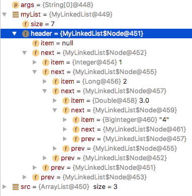

### Необходимо написать свой LinkedList 
**Методы:**

* add(E e) 
* add(int index, E element)
* E get(int index)
* E remove(int index)
* Iterator<E> iterator()

**с использованием wildcards:**
* boolean addAll(Collection c)
* boolean copy(Collection c)

**Результат работы программы:**
<pre>
Содержание нашей коллекции:
[1] [2] [3.0] [4] 
Вставляем элементы в середину и конец:
[1] [2] [3.0] [3.0] [4] [4] 
Удаляем элементы с индексом 2 и 5:
[1] [2] [3.0] [4] 
Добавляем элементы из другой коллекции
[1] [2] [3.0] [4] [5.0] [6] [7] 
Копируем элементы в другую коллекцию (содержимое другой коллекции):
[1] [2] [3.0] [4] [5.0] [6] [7] 
</pre>

