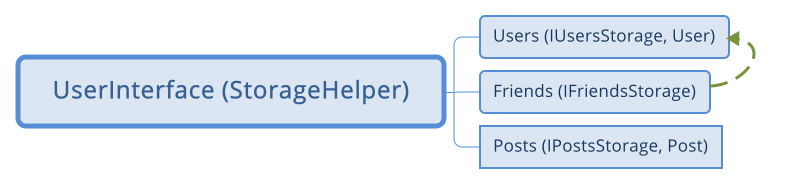

### Спроектировать дизайн соц. сети.
> В данном задании интересует разбитие приложения на модули, взаимодействие интерфейсов, а не реализация конкретных классов.

> Написать юнит тесты к классам из данного задания (с помощью junit + mockito)

Модули приложения:

* Users - содержит класс User (+ тесты) и интерфейс IUserStorage без реализации;
* Post - содержит класс Post (+ тесты) и интерфейс IPostStorage без реализации;
* Friends - содержит интерфейс IFriendStorage без реализации;
* UserInterface - содержит класс StorageHelper с основной логикой и тестами:
    * getProfile - получить профиль пользователя;
    * getWall - получить "стену" пользователя (посты пользователя);
    * getFriends - получить список друзей пользователя;
    * getFeed - получить новости пользователя (посты друзей за последнее время).

[Основные тесты с использованием JUnit и Mockito смотреть тут ](https://github.com/averveiko/javaSchool/blob/master/lesson08/SocialNetwork/UserInterface/src/test/java/ru/sbt/averveyko/socialnetwork/userinterface/StorageHelperTest.java)