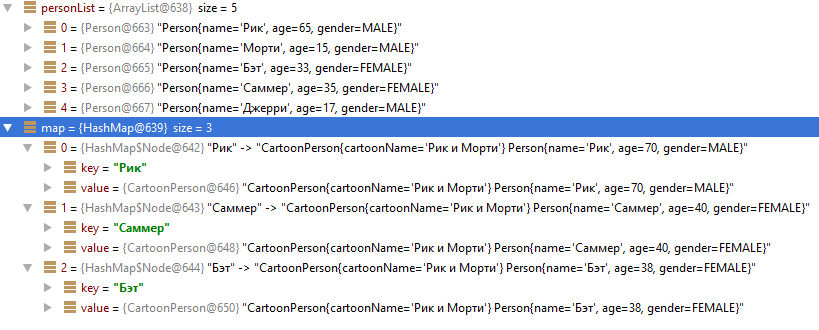

### Реализовать класс похожий на java.util.stream.Stream

* **Streams.of()** - статический метод, который принимает коллекцию и создает новый объект Streams
* **filter()** - оставляет в коллекции только те элементы, которые удовлетворяют условию в лямбде.
* **transform()** - преобразует элемент в другой.
* **toMap** - принимает 2 лямбды для создания мапы, в одной указывается, что использовать в качестве ключа, в другой, что в качестве значения.
* После выполнения всех операций коллекция someCollection не должна поменяться.
* Класс надо параметризовать используя правило PECS

```Java
List<Person> personList = new ArrayList<>();
personList.add(new Person("Рик", 65, Gender.MALE));
...
        
Map<String, CartoonPerson> map = Streams.of(personList)
    .filter(p -> p.getAge() > 30)
    .transform(p -> new CartoonPerson(p.getName(),p.getAge() + 5, p.getGender(),"Рик и Морти"))
    .toMap(CartoonPerson::getName, p -> p);
```



