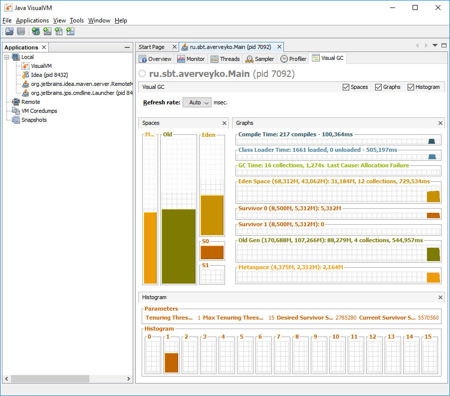
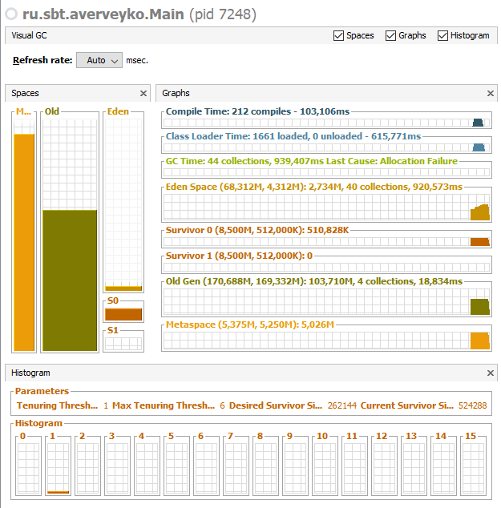
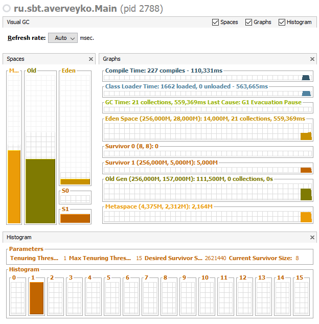

###Проанализировать работу программы:

```Java
public static void main(String[] args) {
    Map<Integer, String> map = new HashMap<>();

    for (int i = 0; i < 100_000; i++) {
        map.put(i,"value" + i);
    }
}
```

* опция -XX:+PrintCompilation

<pre><small>
   1682    1             java.lang.String::hashCode (55 bytes)
   1684    2             java.lang.String::equals (81 bytes)
   1685    3             java.lang.Object::<init> (1 bytes)
   1686    4             java.lang.String::indexOf (70 bytes)
   1688    5             java.lang.CharacterData::of (120 bytes)
   1688    6             java.lang.CharacterDataLatin1::getProperties (11 bytes)
   1689    7             java.lang.String::charAt (29 bytes)
   1690    8             java.lang.String::length (6 bytes)
   1692    9             java.lang.String::startsWith (72 bytes)
   1692   10             sun.nio.cs.UTF_8$Encoder::encode (359 bytes)
   1693   11             java.lang.String::indexOf (166 bytes)
   1694   12             java.lang.AbstractStringBuilder::append (29 bytes)
   1695   13             java.io.WinNTFileSystem::normalize (231 bytes)
   1698   14  s          java.lang.StringBuffer::append (13 bytes)
   1701   15             java.lang.AbstractStringBuilder::ensureCapacityInternal (27 bytes)
   1702   16             java.lang.Math::min (11 bytes)
   1702   17     n       java.lang.System::arraycopy (native)   (static)
   1703   18             java.util.Arrays::copyOfRange (63 bytes)
   1704   19             java.lang.Integer::stringSize (21 bytes)
   1704   20             java.lang.Integer::getChars (131 bytes)
   1704   21             java.lang.String::<init> (82 bytes)
   1705   22             java.lang.String::getChars (62 bytes)
   1705   23             java.lang.AbstractStringBuilder::append (50 bytes)
   1705   24             java.lang.StringBuilder::append (8 bytes)
   1706   25             java.util.HashMap::hash (20 bytes)
   1706   26             java.lang.AbstractStringBuilder::<init> (12 bytes)
   1707   27             java.lang.StringBuilder::toString (17 bytes)
   1707   28             java.lang.StringBuilder::<init> (7 bytes)
   1707   29             java.util.HashMap::putVal (300 bytes)
   1708   30             java.util.HashMap::put (13 bytes)
   1708   31             java.util.HashMap$Node::<init> (26 bytes)
   1708   32             java.lang.Number::<init> (5 bytes)
   1708   33             java.lang.Integer::<init> (10 bytes)
   1708   34             java.util.HashMap::newNode (13 bytes)
   1708   35             java.util.HashMap::afterNodeInsertion (1 bytes)
   1709   36             java.lang.Integer::valueOf (32 bytes)
   1709   37             java.lang.Integer::hashCode (8 bytes)
   1710   38             java.lang.Integer::hashCode (2 bytes)
   1710   39             java.lang.StringBuilder::append (8 bytes)
   1710   40             java.lang.AbstractStringBuilder::append (62 bytes)
   1710   41             java.util.HashMap::resize (359 bytes)
   1718   42 %           ru.sbt.averveyko.Main::main @ 10 (53 bytes)
   1914   43             java.util.Properties$LineReader::readLine (468 bytes)
   1916   44             java.util.Properties::loadConvert (505 bytes)
   </small></pre>
   
   * опции -XX:+PrintCompilation -XX:+UnlockDiagnosticVMOptions -XX:+PrintInlining
<small><pre>
    218    1             java.lang.String::hashCode (55 bytes)
    218    2             java.lang.String::indexOf (70 bytes)
                            @ 66   java.lang.String::indexOfSupplementary (71 bytes)   callee is too large
    219    3             java.lang.String::equals (81 bytes)
    219    4             java.util.Properties$LineReader::readLine (468 bytes)
                            @ 48   java.io.Reader::read (9 bytes)
                              @ 5   java.io.Reader::read (0 bytes)   no static binding
                            @ 62   java.io.InputStream::read (9 bytes)   no static binding
                            @ 311   java.lang.System::arraycopy (0 bytes)   intrinsic
                            @ 396   java.io.Reader::read (9 bytes)
                              @ 5   java.io.Reader::read (0 bytes)   no static binding
                            @ 410   java.io.InputStream::read (9 bytes)   no static binding
    221    5             java.util.Properties::loadConvert (505 bytes)
                            @ 389   java.lang.IllegalArgumentException::<init> (6 bytes)   don't inline Throwable constructors
                            @ 501   java.lang.String::<init> (82 bytes)   callee is too large
    223    6             java.lang.String::charAt (29 bytes)
                            @ 18  java/lang/StringIndexOutOfBoundsException::<init> (not loaded)   not inlineable
    235    7             java.lang.CharacterData::of (120 bytes)
    235    8             java.lang.CharacterDataLatin1::getProperties (11 bytes)
    236    9             java.lang.String::length (6 bytes)
    241   10             java.lang.String::startsWith (72 bytes)
    242   11             sun.nio.cs.UTF_8$Encoder::encode (359 bytes)
                            @ 14   java.lang.Math::min (11 bytes)
                            @ 139   java.lang.Character::isSurrogate (18 bytes)
                            @ 157  sun/nio/cs/Surrogate$Parser::<init> (not loaded)   not inlineable
                            @ 175  sun/nio/cs/Surrogate$Parser::parse (not loaded)   not inlineable
                            @ 186   java.nio.charset.CharsetEncoder::malformedInputAction (5 bytes)
    243   12             java.lang.String::indexOf (166 bytes)
    243   13             java.lang.AbstractStringBuilder::ensureCapacityInternal (27 bytes)
                            @ 17   java.lang.AbstractStringBuilder::newCapacity (39 bytes)   callee is too large
                            @ 20   java.util.Arrays::copyOf (19 bytes)
                              @ 11   java.lang.Math::min (11 bytes)
                              @ 14   java.lang.System::arraycopy (0 bytes)   intrinsic
    244   14             java.lang.AbstractStringBuilder::append (29 bytes)
                            @ 7   java.lang.AbstractStringBuilder::ensureCapacityInternal (27 bytes)
                              @ 17   java.lang.AbstractStringBuilder::newCapacity (39 bytes)   callee is too large
                              @ 20   java.util.Arrays::copyOf (19 bytes)
                                @ 11   java.lang.Math::min (11 bytes)
                                @ 14   java.lang.System::arraycopy (0 bytes)   intrinsic
    244   15             java.io.WinNTFileSystem::normalize (231 bytes)
                            @ 24   java.lang.StringBuffer::<init> (6 bytes)
                              @ 2   java.lang.AbstractStringBuilder::<init> (12 bytes)
                                @ 1   java.lang.Object::<init> (1 bytes)
                            @ 38   java.io.WinNTFileSystem::normalizePrefix (132 bytes)   callee is too large
                            @ 54   java.lang.String::substring (79 bytes)   callee is too large
              s             @ 57   java.lang.StringBuffer::append (13 bytes)
                              @ 7   java.lang.AbstractStringBuilder::append (50 bytes)   callee is too large
                            @ 73   java.lang.String::charAt (29 bytes)
                              @ 18  java/lang/StringIndexOutOfBoundsException::<init> (not loaded)   not inlineable
                            @ 81   java.io.WinNTFileSystem::isSlash (18 bytes)
                            @ 97   java.lang.String::charAt (29 bytes)
                              @ 18  java/lang/StringIndexOutOfBoundsException::<init> (not loaded)   not inlineable
                            @ 100   java.io.WinNTFileSystem::isSlash (18 bytes)
              s             @ 120   java.lang.StringBuffer::length (5 bytes)
              s             @ 134   java.lang.StringBuffer::charAt (28 bytes)
                              @ 17  java/lang/StringIndexOutOfBoundsException::<init> (not loaded)   not inlineable
              s             @ 146   java.lang.StringBuffer::append (13 bytes)
                              @ 7   java.lang.AbstractStringBuilder::append (29 bytes)
                                @ 7   java.lang.AbstractStringBuilder::ensureCapacityInternal (27 bytes)
                                  @ 17   java.lang.AbstractStringBuilder::newCapacity (39 bytes)   callee is too large
                                  @ 20   java.util.Arrays::copyOf (19 bytes)
                                    @ 11   java.lang.Math::min (11 bytes)
                                    @ 14   java.lang.System::arraycopy (0 bytes)   intrinsic
              s             @ 162   java.lang.StringBuffer::append (13 bytes)
                              @ 7   java.lang.AbstractStringBuilder::append (29 bytes)
                                @ 7   java.lang.AbstractStringBuilder::ensureCapacityInternal (27 bytes)
                                  @ 17   java.lang.AbstractStringBuilder::newCapacity (39 bytes)   callee is too large
                                  @ 20   java.util.Arrays::copyOf (19 bytes)
                                    @ 11   java.lang.Math::min (11 bytes)
                                    @ 14   java.lang.System::arraycopy (0 bytes)   intrinsic
              s             @ 179   java.lang.StringBuffer::charAt (28 bytes)
                              @ 17  java/lang/StringIndexOutOfBoundsException::<init> (not loaded)   not inlineable
                            @ 182   java.io.WinNTFileSystem::isSlash (18 bytes)
              s             @ 192   java.lang.StringBuffer::append (13 bytes)
                              @ 7   java.lang.AbstractStringBuilder::append (29 bytes)
                                @ 7   java.lang.AbstractStringBuilder::ensureCapacityInternal (27 bytes)
                                  @ 17   java.lang.AbstractStringBuilder::newCapacity (39 bytes)   callee is too large
                                  @ 20   java.util.Arrays::copyOf (19 bytes)
                                    @ 11   java.lang.Math::min (11 bytes)
                                    @ 14   java.lang.System::arraycopy (0 bytes)   intrinsic
              s             @ 203   java.lang.StringBuffer::append (13 bytes)
                              @ 7   java.lang.AbstractStringBuilder::append (29 bytes)
                                @ 7   java.lang.AbstractStringBuilder::ensureCapacityInternal (27 bytes)
                                  @ 17   java.lang.AbstractStringBuilder::newCapacity (39 bytes)   callee is too large
                                  @ 20   java.util.Arrays::copyOf (19 bytes)
                                    @ 11   java.lang.Math::min (11 bytes)
                                    @ 14   java.lang.System::arraycopy (0 bytes)   intrinsic
              s             @ 214   java.lang.StringBuffer::append (13 bytes)
                              @ 7   java.lang.AbstractStringBuilder::append (29 bytes)
                                @ 7   java.lang.AbstractStringBuilder::ensureCapacityInternal (27 bytes)
                                  @ 17   java.lang.AbstractStringBuilder::newCapacity (39 bytes)   callee is too large
                                  @ 20   java.util.Arrays::copyOf (19 bytes)
                                    @ 11   java.lang.Math::min (11 bytes)
                                    @ 14   java.lang.System::arraycopy (0 bytes)   intrinsic
              s             @ 223   java.lang.StringBuffer::toString (36 bytes)   callee is too large
    436   16  s          java.lang.StringBuffer::append (13 bytes)
                            @ 7   java.lang.AbstractStringBuilder::append (29 bytes)
                              @ 7   java.lang.AbstractStringBuilder::ensureCapacityInternal (27 bytes)
                                @ 17   java.lang.AbstractStringBuilder::newCapacity (39 bytes)   callee is too large
                                @ 20   java.util.Arrays::copyOf (19 bytes)
                                  @ 11   java.lang.Math::min (11 bytes)
                                  @ 14   java.lang.System::arraycopy (0 bytes)   intrinsic
    441   17             java.io.WinNTFileSystem::normalize (143 bytes)
                            @ 1   java.lang.String::length (6 bytes)
                            @ 31   java.lang.String::charAt (29 bytes)
                              @ 18  java/lang/StringIndexOutOfBoundsException::<init> (not loaded)   not inlineable
                            @ 61   java.io.WinNTFileSystem::normalize (231 bytes)   callee is too large
                            @ 90   java.io.WinNTFileSystem::normalize (231 bytes)   callee is too large
                            @ 111   java.io.WinNTFileSystem::normalize (231 bytes)   callee is too large
                            @ 137   java.io.WinNTFileSystem::normalize (231 bytes)   callee is too large
    442   18             java.lang.Object::<init> (1 bytes)
    442   19             java.lang.Math::min (11 bytes)
    445   20     n       java.lang.System::arraycopy (native)   (static)
    447   21             java.util.Arrays::copyOfRange (63 bytes)
                            @ 16   java.lang.StringBuilder::<init> (7 bytes)
                              @ 3   java.lang.AbstractStringBuilder::<init> (12 bytes)
                                @ 1   java.lang.Object::<init> (1 bytes)
                            @ 20   java.lang.StringBuilder::append (8 bytes)
                              @ 2   java.lang.AbstractStringBuilder::append (62 bytes)   callee is too large
                            @ 25   java.lang.StringBuilder::append (8 bytes)
                              @ 2   java.lang.AbstractStringBuilder::append (50 bytes)   callee is too large
                            @ 29   java.lang.StringBuilder::append (8 bytes)
                              @ 2   java.lang.AbstractStringBuilder::append (62 bytes)   callee is too large
                            @ 32   java.lang.StringBuilder::toString (17 bytes)
                              @ 13   java.lang.String::<init> (82 bytes)   callee is too large
                            @ 35   java.lang.IllegalArgumentException::<init> (6 bytes)   don't inline Throwable constructors
                            @ 54   java.lang.Math::min (11 bytes)
                            @ 57   java.lang.System::arraycopy (0 bytes)   intrinsic
    449   22             java.lang.Integer::stringSize (21 bytes)
    449   23             java.lang.Integer::getChars (131 bytes)
    449   24             java.lang.String::<init> (82 bytes)
                            @ 1   java.lang.Object::<init> (1 bytes)
                            @ 13  java/lang/StringIndexOutOfBoundsException::<init> (not loaded)   not inlineable
                            @ 30  java/lang/StringIndexOutOfBoundsException::<init> (not loaded)   not inlineable
                            @ 65  java/lang/StringIndexOutOfBoundsException::<init> (not loaded)   not inlineable
                            @ 75   java.util.Arrays::copyOfRange (63 bytes)   callee is too large
    450   25             java.lang.String::getChars (62 bytes)
                            @ 9  java/lang/StringIndexOutOfBoundsException::<init> (not loaded)   not inlineable
                            @ 27  java/lang/StringIndexOutOfBoundsException::<init> (not loaded)   not inlineable
                            @ 43  java/lang/StringIndexOutOfBoundsException::<init> (not loaded)   not inlineable
                            @ 58   java.lang.System::arraycopy (0 bytes)   intrinsic
    450   26             java.lang.AbstractStringBuilder::append (50 bytes)
                            @ 5   java.lang.AbstractStringBuilder::appendNull (56 bytes)   callee is too large
                            @ 10   java.lang.String::length (6 bytes)
                            @ 21   java.lang.AbstractStringBuilder::ensureCapacityInternal (27 bytes)
                              @ 17   java.lang.AbstractStringBuilder::newCapacity (39 bytes)   callee is too large
                              @ 20   java.util.Arrays::copyOf (19 bytes)
                                @ 11   java.lang.Math::min (11 bytes)
                                @ 14   java.lang.System::arraycopy (0 bytes)   intrinsic
                            @ 35   java.lang.String::getChars (62 bytes)   callee is too large
    452   27             java.lang.StringBuilder::append (8 bytes)
                            @ 2   java.lang.AbstractStringBuilder::append (50 bytes)   callee is too large
    453   28             java.util.HashMap::hash (20 bytes)
                            @ 9   java.lang.Object::hashCode (0 bytes)   no static binding
    453   29             java.lang.AbstractStringBuilder::<init> (12 bytes)
                            @ 1   java.lang.Object::<init> (1 bytes)
    453   30             java.lang.StringBuilder::toString (17 bytes)
                            @ 13   java.lang.String::<init> (82 bytes)   callee is too large
    453   31             java.lang.StringBuilder::<init> (7 bytes)
                            @ 3   java.lang.AbstractStringBuilder::<init> (12 bytes)
                              @ 1   java.lang.Object::<init> (1 bytes)
    455   32             java.util.HashMap::putVal (300 bytes)
                            @ 20   java.util.HashMap::resize (359 bytes)   callee is too large
                            @ 56   java.util.HashMap::newNode (13 bytes)   no static binding
                            @ 91   java.lang.Object::equals (11 bytes)   no static binding
                            @ 123   java.util.HashMap$TreeNode::putTreeVal (314 bytes)   not inlineable
                            @ 152   java.util.HashMap::newNode (13 bytes)   no static binding
                            @ 169   java.util.HashMap::treeifyBin (110 bytes)   callee is too large
                            @ 203   java.lang.Object::equals (11 bytes)   no static binding
                            @ 253   java.util.HashMap::afterNodeAccess (1 bytes)   no static binding
                            @ 288   java.util.HashMap::resize (359 bytes)   callee is too large
                            @ 295   java.util.HashMap::afterNodeInsertion (1 bytes)   no static binding
    457   33             java.util.HashMap::put (13 bytes)
                            @ 2   java.util.HashMap::hash (20 bytes)
                              @ 9   java.lang.Object::hashCode (0 bytes)   no static binding
                            @ 9   java.util.HashMap::putVal (300 bytes)   callee is too large
    457   34             java.util.HashMap$Node::<init> (26 bytes)
                            @ 1   java.lang.Object::<init> (1 bytes)
    457   35             java.lang.Number::<init> (5 bytes)
                            @ 1   java.lang.Object::<init> (1 bytes)
    458   36             java.lang.Integer::<init> (10 bytes)
                            @ 1   java.lang.Number::<init> (5 bytes)
                              @ 1   java.lang.Object::<init> (1 bytes)
    458   37             java.util.HashMap::newNode (13 bytes)
                            @ 9   java.util.HashMap$Node::<init> (26 bytes)
                              @ 1   java.lang.Object::<init> (1 bytes)
    458   38             java.util.HashMap::afterNodeInsertion (1 bytes)
    458   39             java.lang.Integer::valueOf (32 bytes)
                            @ 28   java.lang.Integer::<init> (10 bytes)
                              @ 1   java.lang.Number::<init> (5 bytes)
                                @ 1   java.lang.Object::<init> (1 bytes)
    459   40             java.lang.StringBuilder::append (8 bytes)
                            @ 2   java.lang.AbstractStringBuilder::append (62 bytes)   callee is too large
    459   41             java.lang.AbstractStringBuilder::append (62 bytes)
                            @ 9   java.lang.AbstractStringBuilder::append (50 bytes)   no static binding
                            @ 21   java.lang.Integer::stringSize (21 bytes)
                            @ 30   java.lang.Integer::stringSize (21 bytes)
                            @ 43   java.lang.AbstractStringBuilder::ensureCapacityInternal (27 bytes)
                              @ 17   java.lang.AbstractStringBuilder::newCapacity (39 bytes)   callee is too large
                              @ 20   java.util.Arrays::copyOf (19 bytes)
                                @ 11   java.lang.Math::min (11 bytes)
                                @ 14   java.lang.System::arraycopy (0 bytes)   intrinsic
                            @ 52   java.lang.Integer::getChars (131 bytes)   callee is too large
    461   42             java.lang.Integer::hashCode (8 bytes)
                            @ 4   java.lang.Integer::hashCode (2 bytes)
    461   43             java.lang.Integer::hashCode (2 bytes)
    461   44             java.util.HashMap::resize (359 bytes)
                            @ 220   java.util.HashMap$TreeNode::split (218 bytes)   not inlineable
    518   45 %           ru.sbt.averveyko.Main::main @ 10 (53 bytes)
                             @ 4   java.util.HashMap::<init> (11 bytes)
                              @ 1   java.util.AbstractMap::<init> (5 bytes)
                                @ 1   java.lang.Object::<init> (1 bytes)
                            @ 18   java.lang.Integer::valueOf (32 bytes)
                              @ 28   java.lang.Integer::<init> (10 bytes)
                                @ 1   java.lang.Number::<init> (5 bytes)
                                  @ 1   java.lang.Object::<init> (1 bytes)
                            @ 25   java.lang.StringBuilder::<init> (7 bytes)
                              @ 3   java.lang.AbstractStringBuilder::<init> (12 bytes)
                                @ 1   java.lang.Object::<init> (1 bytes)
                            @ 30   java.lang.StringBuilder::append (8 bytes)
                              @ 2   java.lang.AbstractStringBuilder::append (50 bytes)   callee is too large
                            @ 34   java.lang.StringBuilder::append (8 bytes)
                              @ 2   java.lang.AbstractStringBuilder::append (62 bytes)   callee is too large
                            @ 37   java.lang.StringBuilder::toString (17 bytes)
                              @ 13   java.lang.String::<init> (82 bytes)   callee is too large
                            @ 40   java.util.Map::put (0 bytes)   no static binding
</small></pre>

**GC**

* Default Java 8 GC: Parallel GC


* -XX:+UseSerialGC


* -XX:+UseConcMarkSweepGC


* -XX:+UseG1GC



