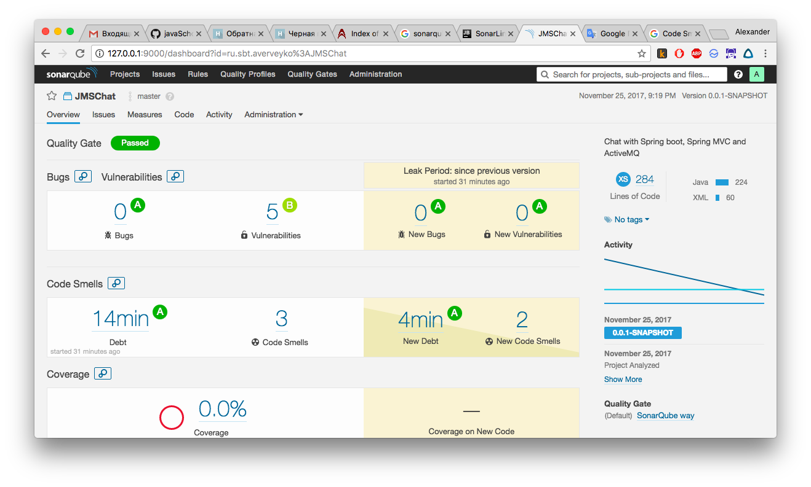

### Задание: установить SONAR, снять статистику со своего проекта.

В качестве "подопытного" использован [проект чата на JMS и Spring MVC](https://github.com/averveiko/javaSchool/tree/master/lesson30)


В IDEA добавил комманду
```sh
mvn sonar:sonar \
  -Dsonar.host.url=http://127.0.0.1:9000 \
  -Dsonar.login=31ef4b51e1c6e289351fa73336b8f2fb621d9d51
```

Запустил анализ:
<pre>
[INFO] ANALYSIS SUCCESSFUL, you can browse http://127.0.0.1:9000/dashboard/index/ru.sbt.averveyko:JMSChat
[INFO] Note that you will be able to access the updated dashboard once the server has processed the submitted analysis report
[INFO] More about the report processing at http://127.0.0.1:9000/api/ce/task?id=AV_0TIgwls-FmtndU1hX
</pre>

Главная страница


Vulnerabilities(Уязвимости)


Code Smells ("Код с запашком")


После устранения некоторых проблем:



