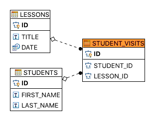

### Написать Dao классы по работе с расписанием (редактирование посещаемости, базовая статистика)

* Students - информация о студентах (колонки: id, имя, фамилия)
* Lessons - расписания занятий (колонки: id, название лекции, дата)
* Student_visits - посещаемость студентов (student_id, lesson_id)

#### Диаграмма БД

#### Проверка работы
<pre>
Drop tables if exist

Create tables

Adding students
Student{id=1, firstName='Bill', lastName='Gates'}
Student{id=2, firstName='Steve', lastName='Jobs'}
Student{id=3, firstName='Linus', lastName='Torvalds'}

Getting student from DB by PK
Student{id=1, firstName='Bill', lastName='Gates'}

Getting all students from DB
Student{id=1, firstName='Bill', lastName='Gates'}
Student{id=2, firstName='Steve', lastName='Jobs'}
Student{id=3, firstName='Linus', lastName='Torvalds'}

Update student Linus
Student{id=3, firstName='LINUS', lastName='TORVALDS'}

Delete student Bill
Student{id=2, firstName='Steve', lastName='Jobs'}
Student{id=3, firstName='LINUS', lastName='TORVALDS'}

Adding lessons

Getting lesson from DB by PK
Lesson{id=1, title='mathematics', date=2017-12-01 09:00:00.0}

Getting all lessons from DB
Lesson{id=1, title='mathematics', date=2017-12-01 09:00:00.0}
Lesson{id=2, title='physics', date=2017-12-01 11:00:00.0}
Lesson{id=3, title='programming', date=2017-12-01 13:00:00.0}

Update second lesson
Lesson{id=2, title='PHYSICS', date=2017-12-01 11:30:00.0}

Delete third lesson
Lesson{id=1, title='mathematics', date=2017-12-01 09:00:00.0}
Lesson{id=2, title='PHYSICS', date=2017-12-01 11:30:00.0}

Adding student visits

Getting student visits from DB by PK
StudentVisits{id=1, studentId=2, lessonId=1}

Getting all student visits from DB
StudentVisits{id=1, studentId=2, lessonId=1}
StudentVisits{id=2, studentId=3, lessonId=2}
StudentVisits{id=3, studentId=2, lessonId=2}

Update student visits 3
StudentVisits{id=3, studentId=3, lessonId=1}

Delete student visits 3
StudentVisits{id=1, studentId=2, lessonId=1}
StudentVisits{id=2, studentId=3, lessonId=2}
</pre>