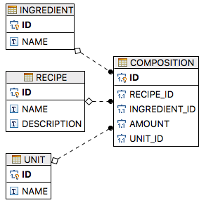

# Разработать консольное приложение для хранения рецептов

### Схема

### Добавление и поиск рецепта
<pre>
# База рецептов #
1. Поиск рецепта по имени (или части имени);
2. Добавление рецепта;
3. Удаление рецепта;
4. Выход из программы.
 
Введите номер операции: 2
Введите название рецепта: Макароны по-флотски
Введите описание рецепта: Классика
 
Ввод состава рецепта
1. Мясо
3. Картошечка
4. Соль
5. Колбаса докторская
6. Сыр
7. Хлеб
Введите id требуемого ингредиента, n для ввода нового, q для завершения редактирования: n
 
Введите наименование нового ингредиента: Макароны
Введите единицу измерения ингредиента Макароны :
1. кг
2. г
Введите id требуемой ед. изм., n для ввода новой, q для завершения редактирования: 2
Введите требуемое количество ингредиента (в г): 
200
Ингредиент добавлен (Макароны 200.0 г)
 
Ввод состава рецепта
1. Мясо
3. Картошечка
4. Соль
5. Колбаса докторская
6. Сыр
7. Хлеб
Введите id требуемого ингредиента, n для ввода нового, q для завершения редактирования: 1
Введите единицу измерения ингредиента Мясо :
1. кг
2. г
Введите id требуемой ед. изм., n для ввода новой, q для завершения редактирования: 2
Введите требуемое количество ингредиента (в г): 
100
Ингредиент добавлен (Мясо 100.0 г)
 
Ввод состава рецепта
1. Мясо
3. Картошечка
4. Соль
5. Колбаса докторская
6. Сыр
7. Хлеб
Введите id требуемого ингредиента, n для ввода нового, q для завершения редактирования: n
 
Введите наименование нового ингредиента: Лук
Введите единицу измерения ингредиента Лук :
1. кг
2. г
Введите id требуемой ед. изм., n для ввода новой, q для завершения редактирования: n
 
Введите наименование новой ед. изм.: шт.
Введите требуемое количество ингредиента (в шт.): 
1
Ингредиент добавлен (Лук 1.0 шт.)
 
Ввод состава рецепта
1. Мясо
3. Картошечка
4. Соль
5. Колбаса докторская
6. Сыр
7. Хлеб
Введите id требуемого ингредиента, n для ввода нового, q для завершения редактирования: n
 
Введите наименование нового ингредиента: Томатная паста
Введите единицу измерения ингредиента Томатная паста :
1. кг
2. г
Введите id требуемой ед. изм., n для ввода новой, q для завершения редактирования: n
 
Введите наименование новой ед. изм.: Банка
Введите требуемое количество ингредиента (в Банка): 
1
Ингредиент добавлен (Томатная паста 1.0 Банка)
 
Ввод состава рецепта
1. Мясо
3. Картошечка
4. Соль
5. Колбаса докторская
6. Сыр
7. Хлеб
Введите id требуемого ингредиента, n для ввода нового, q для завершения редактирования: q
Добавлен 1 рецепт: Макароны по-флотски
Добавлен 1 ингредиент: Макароны
Ед. изм. id 2 уже сохранена в базе
Ингредиент id 1 уже сохранен в базе
Ед. изм. id 2 уже сохранена в базе
Добавлен 1 ингредиент: Лук
Добавлена 1 ед. изм.: шт.
Добавлен 1 ингредиент: Томатная паста
Добавлена 1 ед. изм.: Банка
Добавлен состав рецепта: 'Макароны по-флотски', кол-во ингредиентов: 4
Новый рецепт успешно сохранен.
# База рецептов #
1. Поиск рецепта по имени (или части имени);
2. Добавление рецепта;
3. Удаление рецепта;
4. Выход из программы.
 
Введите номер операции: 1
Введите название рецепта (или его часть): флот
Поиск рецептов, название которых содержит: флот
Найдено 1 рецепт(ов)
 
Рецепт: Макароны по-флотски
Описание: Классика
Состав рецепта:
1. Макароны (200.0 г);
2. Мясо (100.0 г);
3. Лук (1.0 шт.);
4. Томатная паста (1.0 Банка);
 
# База рецептов #
1. Поиск рецепта по имени (или части имени);
2. Добавление рецепта;
3. Удаление рецепта;
4. Выход из программы.
 
Введите номер операции: 4
Всего доброго!
</pre>

### Удаление рецепта
<pre>
Удаление рецепта
1. Бутерброд царский
2. Макароны по-флотски
Введите id рецепта, который требуется удалить (0 - отмена): 2
Удален 1 рецепт 
Удалены составляющие рецепта id: 2 (4 строк)
</pre>