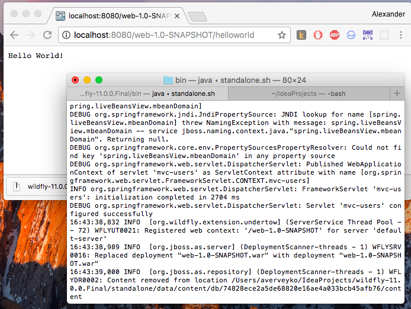

### Запустить приложение javaschool_mvc на WildFly

* Собираем root package
* Копируем war в wildfly-11.0.0.Final/standalone/deployments
* Запускаем WildFly wildfly-11.0.0.Final/bin/standalone.sh
* Переходим в браузере http://localhost:8080/web-1.0-SNAPSHOT/

#### Результат:

