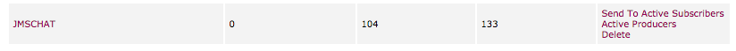
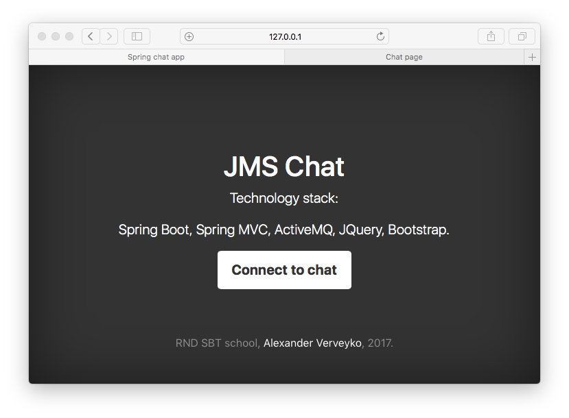
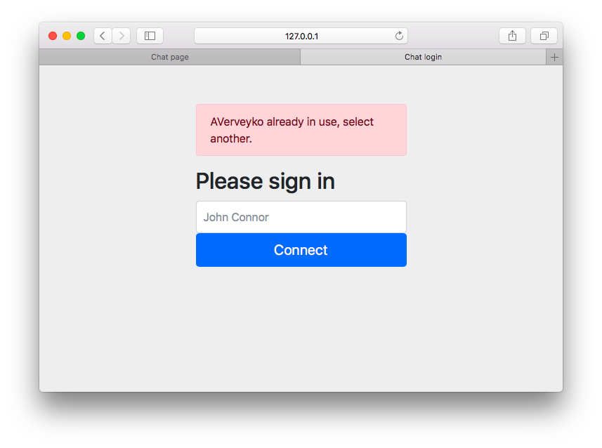
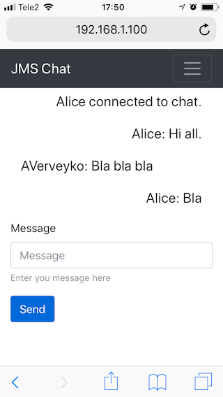
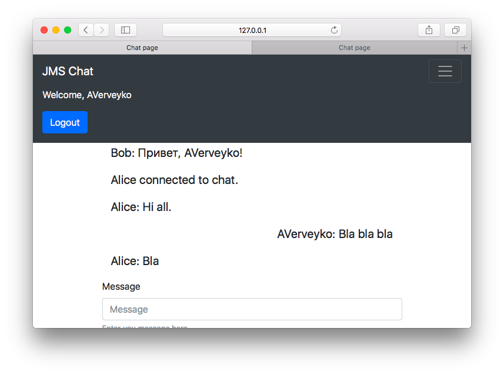

## Реализовать сетевой чат.
### Чат должен представлять собой web-приложение, которое работает с REST сервисом, реализованном с помощью Spring WEB MVC.

* Обмен сообщениями происходит через REST API с помощью AJAX-запросов (используется JQuery).
* Сообщения хранятся в топике ActiveMQ.

* Серверная часть построена при помощи Spring Boot, Spring MVC.
* На клиенте используется css-framework Bootstrap 4.
* Сообщения подгружаются и отправляются без перезагрузки страницы 

#### Интерфейс
Страница сервиса

Страница входа (Проверяется уникальность имени пользователя)

Чат из мобильного браузера

Кнопка выхода из чата

